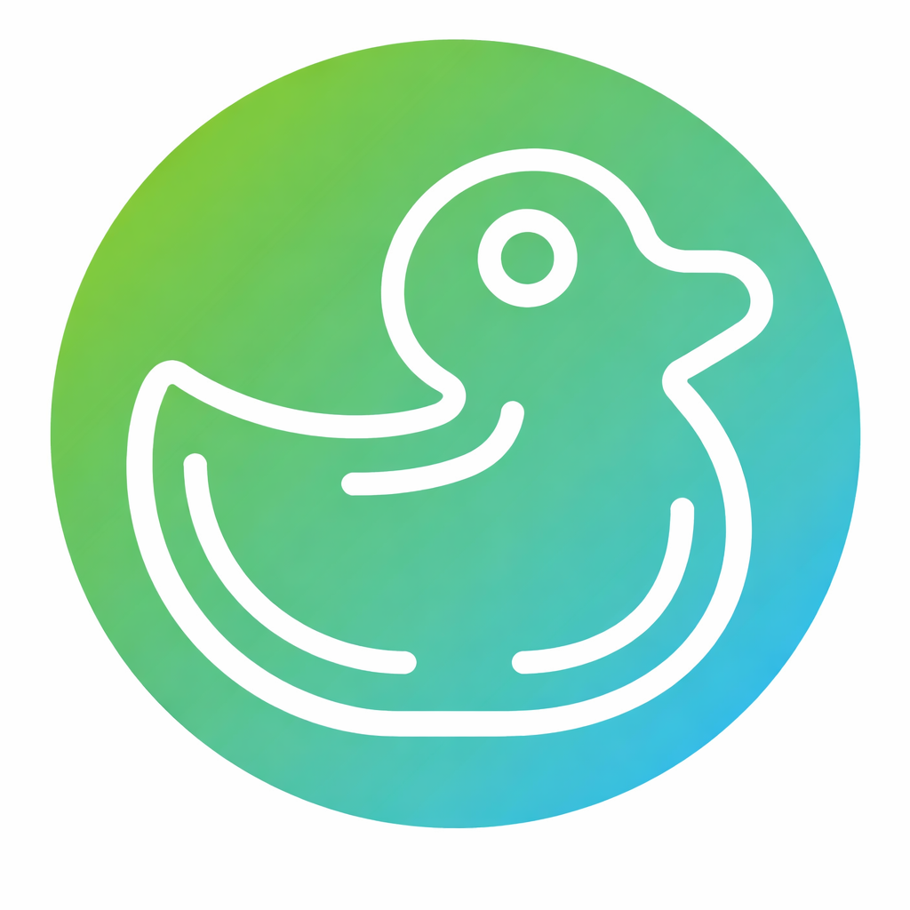
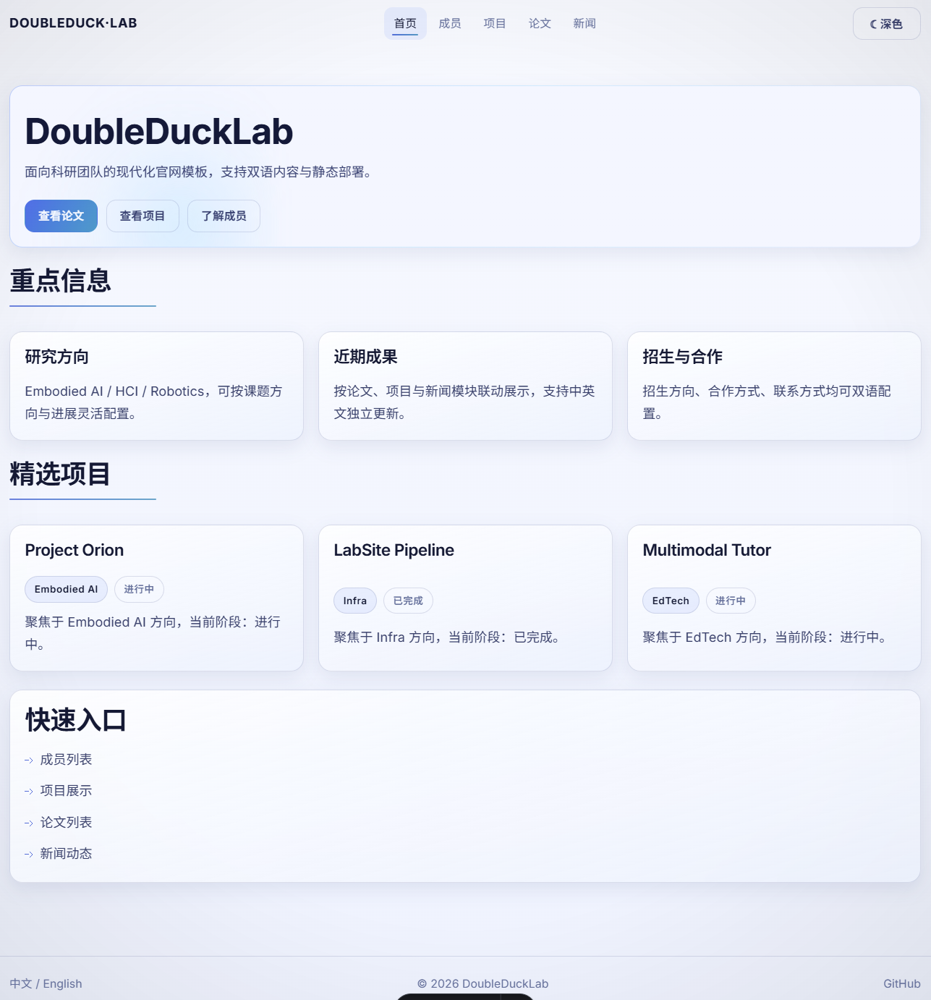
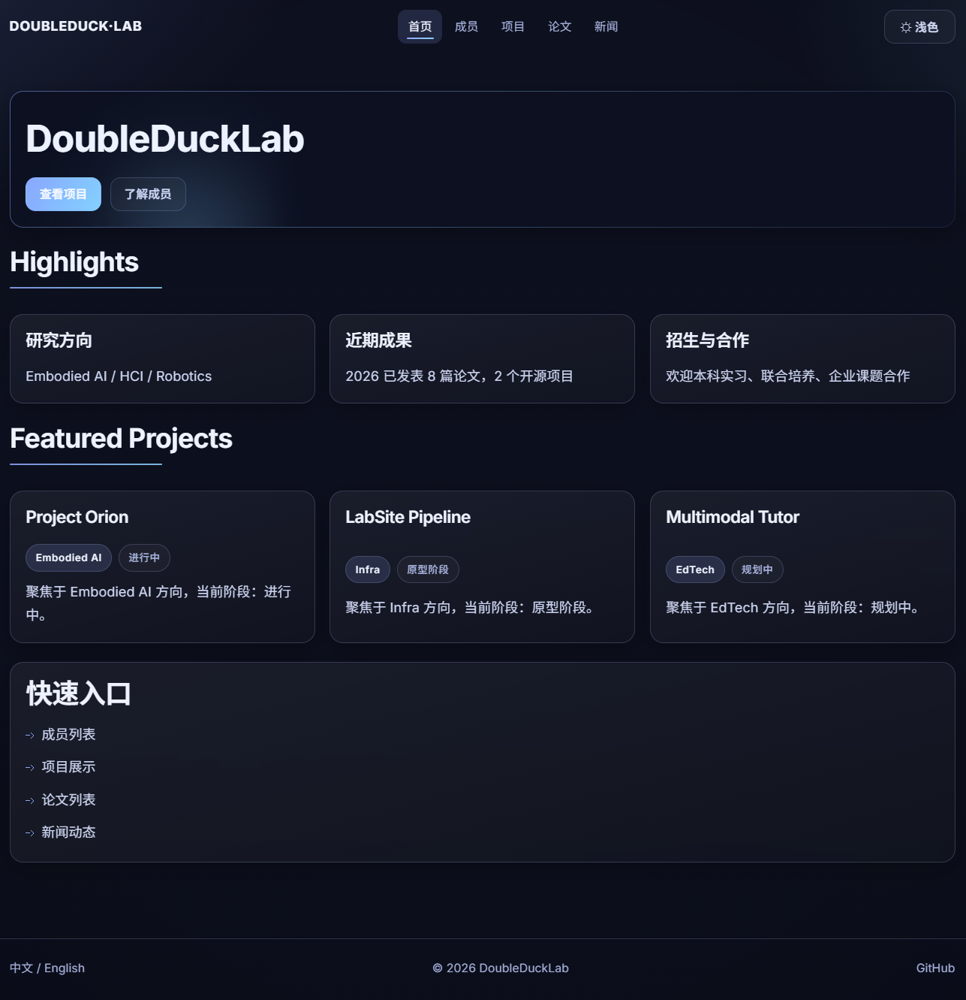

<p align="center">
  
</p>

# DoubleDuckLab (DDLab)

<p align="right">
  中文 | <a href="./README_EN.md">English</a>
</p>

一个基于 Astro 的双语课题组官网模板，面向“本地优先、文件驱动、可持续维护”的内容工作流。

## 预览

- 在线预览：[https://doubleducklab.com](https://doubleducklab.com)

<p align="center">
  <a href="https://doubleducklab.com" target="_blank">
    
  </a>
  <a href="https://doubleducklab.com" target="_blank">
    
  </a>
</p>

## 快速开始

```bash
git clone https://github.com/nightt5879/doubleducklab.git
cd doubleducklab
npm install
npm run validate:content
npm run build
npm run test:smoke
npm run test:seo
npm run preview
```

Windows 一键校验：

```bat
verify.bat
```

默认访问：

- `http://localhost:4321/`
- `http://localhost:4321/en/`

## 生产域名配置

默认生产域名兜底为 `https://doubleducklab.com`。如需替换，请在本地 `.env` 中设置：

```bash
PUBLIC_SITE_URL=https://your-domain.example
```

构建时会使用这个地址生成 canonical、Open Graph URL 与 hreflang。

## 当前唯一真源

### 站点级文案
- `src/data/site.zh.json`
- `src/data/site.en.json`

### 内容集合
- 成员：`src/content/members/*.md`
- 项目：`src/content/projects/<slug>/`
- 论文：`src/content/papers/*.md`
- 新闻：`src/content/news/<slug>/`
- 招生与合作：`src/content/join/recruitment/`

> `src/data/content/*` 已废弃，不再使用。

## 内容结构

### 成员

每位成员一个文件：

```text
src/content/members/<id>.md
```

最小模板：

```md
---
id: "zhang-wei"
name:
  zh: "张伟"
  en: "Wei Zhang"
role:
  zh: "博士生"
  en: "PhD"
area:
  zh: "多模态智能体"
  en: "Multimodal Agents"
---
```

### 项目

每个项目一个目录：

```text
src/content/projects/<slug>/
  overview_cn.md
  overview_en.md
  background_cn.md
  background_en.md
```

`overview_cn.md` 示例：

```md
---
title: "猎户座项目"
tag: "Embodied AI"
time: "2026"
status: "进行中"
---
这里写项目概览。
```

### 新闻

每条新闻一个目录：

```text
src/content/news/<slug>/
  中文标题_cn.md
  English_title_en.md
```

新闻正文文件最少包含：

```md
---
date: "2026-03-25"
---

这里写新闻正文。
```

### 论文

```text
src/content/papers/<slug>.md
```

最小模板：

```md
---
year: 2026
title: "Paper Title"
venue: "Conference Name"
---
```

## 验证链路

- `npm run validate:content`
  - 校验站点文案、成员、项目、论文、新闻、招生与合作的文件结构
- `npm run build`
  - 生成静态站点
- `npm run test:smoke`
  - 检查 `/`、`/en/`、`/members`、`/projects`、`/papers`、`/news` 的构建结果
- `npm run test:seo`
  - 检查 canonical、Open Graph、hreflang、404 noindex 与当前页语言互跳
- `verify.bat`
  - 依次执行 `validate:content`、`build`、`test:smoke`、`test:seo`
  - 自动设置 `ASTRO_TELEMETRY_DISABLED=1`
  - 适合 Windows 下双击或命令行一键验收

## 文档入口

- 内容地图：[content-map.md](./content-map.md)
- 内容编辑指南：[docs/content-edit-guide.md](./docs/content-edit-guide.md)
- 内容维护清单：[docs/content-ops-checklist.md](./docs/content-ops-checklist.md)
- 发布验收清单：[docs/release-baseline-checklist.md](./docs/release-baseline-checklist.md)
- 路线图：[docs/roadmap.md](./docs/roadmap.md)

## Roadmap

- `1.0.1`：基线修复，修乱码、收真源、补 CI / smoke
- `1.1.0`：生产域名、SEO 元信息、当前页中英互跳与构建后 SEO 校验
- `1.1.1`：review follow-up，修 alternate 可用性、内部链接 URL 一致性与 `test:seo` 站点地址读取
- `1.2.0`：先给 `news` 接 CMS

## License

MIT
