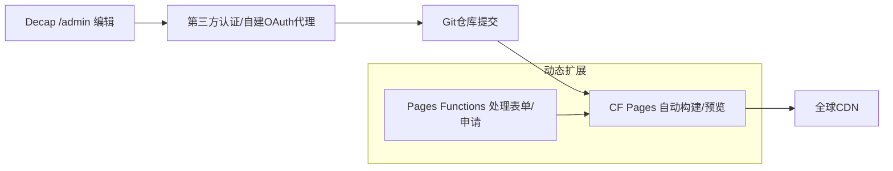
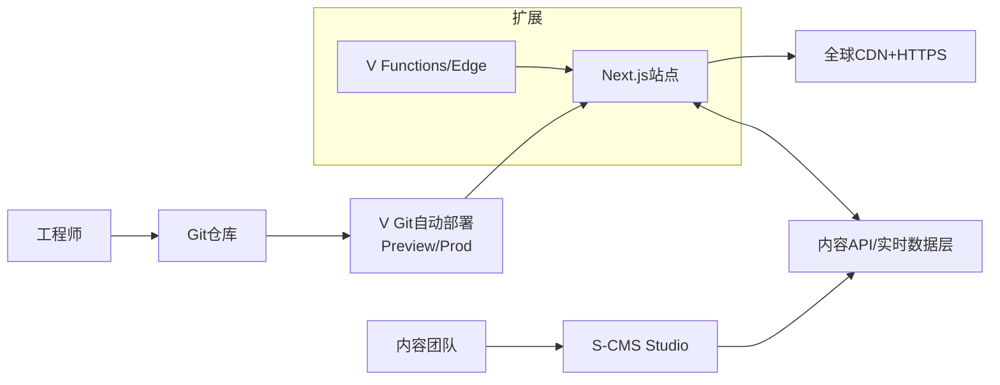
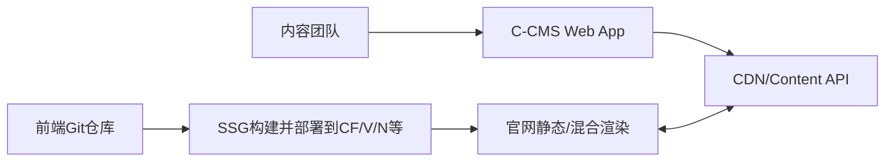
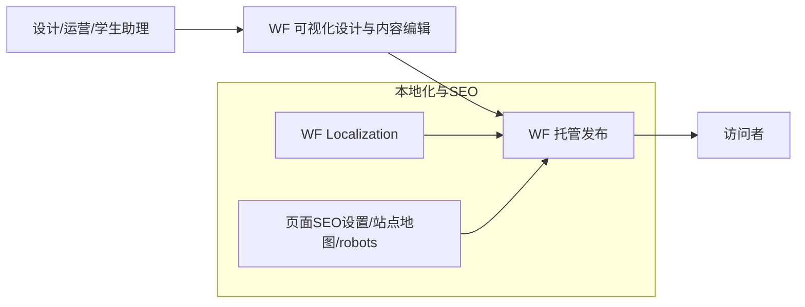

# 课题组官网技术栈调研报告

## 执行摘要

本调研围绕“课题组官网技术栈与工作流”给出可落地的候选方案对比，并以“现代顺滑 UI + 技术感 + 极低后端运维”为优先级，兼顾非工程师可编辑、多成员协作、混合媒体内容、Git + CI、SEO 与国际化、可扩展表单/公告/英文版等需求。结论上，最推荐采用“静态站点生成（SSG）+ Git 工作流 + 轻量内容后台（Git-based CMS 或托管 Headless CMS）”的路线：它天然具备**高安全性（静态化降低攻击面）**、**低成本 CDN 托管**、**可审计的版本历史**，并能在后期按需叠加“表单/申请/数据可视化/英文站”等功能模块。citeturn15search2turn15search4turn18search2turn21view0

为了避免在全文中重复平台名，下文首次出现时标注简称：entity["company","Cloudflare","web infrastructure vendor"]→“CF”；entity["company","Netlify","web dev platform"]→“N”；entity["company","Vercel","frontend cloud platform"]→“V”；entity["company","GitHub","code hosting platform"]→“GH”；entity["company","Sanity","headless cms vendor"]→“S-CMS”；entity["company","Contentful","headless cms vendor"]→“C-CMS”；entity["company","Webflow","no-code site builder"]→“WF”；entity["company","Notion","workspace software"]→“NT”；entity["company","Formspree","form backend service"]→“FS”。（后文均使用简称，减少干扰。）citeturn20search9turn13search4turn21view0turn11view0turn10view0turn5view0turn4search2turn13search11

**首选推荐（综合平衡型）**：  
- **方案 A（推荐首发）**：CF Pages 托管 + Astro（SSG）+ 内容以 Markdown/MDX 为主 +（可选）Decap CMS 作为非工程师编辑后台；表单/申请走“第三方表单后端（如 FS）或 CF Pages Functions”。该组合在免费/低预算下可获得非常高的性能与稳定性，CF 提供 Git 集成、预览部署、可自定义域名，且免费计划对 Pages 构建次数与自定义域名数量给出明确额度；同时 Pages Functions 支持“无专用服务器”的动态能力（表单处理/鉴权/中间件）。citeturn21view0turn3search3turn3search11turn13search5turn23search2turn23search5  
- **方案 B（编辑体验最强）**：V 托管 + Next.js + S‑CMS（Studio + Visual Editing/Presentation）。它的优势是“内容团队体验接近商用 DXP”：实时协作、可视化预览/点击编辑链路成熟，且 V 的 Git 部署、预览环境、HTTPS/证书自动化非常完善；成本以“席位 + 用量”计费，需要提前做预算与限额治理。citeturn3search2turn18search4turn5view0turn16search5turn16search1turn20search23turn20search2

**风险提示（必须纳入方案设计）**：如果选择 Decap CMS 并依赖 N 的 Identity/Git Gateway，需要注意该身份能力经历过“官方弃用/策略调整”的阶段：有过“已弃用、只修安全问题、不再修 bug/不再排障”的公告，但随后又发布“将继续作为受支持的认证选项”的更新；因此应设计“可替换的认证路径”和“从 Git‑Gateway 切换到 GitHub 直连或第三方认证”的迁移预案。citeturn14search3turn14search8turn15search0turn15search14

---

## 调研方法与评估框架

本类“官网技术栈调研”建议按“目标→约束→候选→证据→权衡→迁移路径”推进，避免只比较“工具名气”。核心步骤如下：  
第一步，把官网拆成“内容域 + 工作流域 + 运维域 + 增长域（SEO/分析）”。内容域包括：成员/论文/项目/新闻/公告/招生与申请表单/多语言；工作流域包括：非工程师编辑、多人并行、审稿发布、回滚；运维域包括：HTTPS、自动部署、权限、日志与成本；增长域包括：SEO、站点地图、多语言 hreflang、可访问性与性能。该拆法与静态站点 + Git 工作流的优势高度匹配：内容与代码同库便于版本化与审计；静态构建在 CDN 上交付，能显著降低传统服务端 CMS 的攻击面与运维开销。citeturn15search4turn19search17turn21view0turn18search2

第二步，为每项指标定义“可观测证据”，优先使用官方文档/定价页/项目站点：  
- 托管与部署：Git 自动部署、分支预览（Preview Deployments/Deploy Previews）、自定义域名、HTTPS/证书自动签发。citeturn3search3turn3search2turn18search2turn18search4turn18search3turn21view0  
- 内容编辑：是否提供“可视化编辑/内容角色权限/审稿发布流”。例如 Decap 的 Editorial Workflow 会为未发布条目创建 PR；WF 提供内容编辑角色与实时协作；S‑CMS 的 Presentation/Visual Editing 提供“预览即编辑”。citeturn16search0turn16search19turn16search3turn16search5turn16search1  
- 国际化与 SEO：Astro 提供官方 i18n Routing 与 sitemap 集成；Next.js 提供 i18n 指南（pages 与 app router 各有入口）；Hugo 有多语言框架；WF 本地化功能会生成 lang/hreflang 并写入 sitemap；Docusaurus 内置 i18n。citeturn23search0turn23search1turn22search2turn22search1turn22search4turn17search0turn22search0  
- 扩展（表单/申请/动态）：CF Pages Functions、V Functions 都能在无专用服务器前提下处理表单提交/鉴权；N 的 Forms 能对静态站提供表单后端（不同计费模型下限额与计费方式不同）；FS 也提供通用表单后端且有明确的免费额度起点。citeturn13search5turn13search2turn14search1turn14search12turn14search7turn13search11

第三步，用“先简后繁”的迁移路线做决策：先上线一个结构清晰、性能好、可持续维护的“内容型官网”，再逐步增加申请表单、公告系统、可视化、英文版本与更复杂的权限/审稿机制。此策略与多家平台“分支预览 + 自动部署”的能力天然契合。citeturn3search5turn3search6turn3search7

---

## 候选技术栈对比总览

本节给出 9 个候选栈（覆盖 SSG+CMS、托管 Headless CMS、托管/无代码、以及混合扩展路线）。对比表先给出“属性结论”（偏主观评分），详细证据与成本在下一节逐项展开。

| 候选方案（简称） | 非工程师编辑 | 多人协作与审核 | i18n/SEO | 混合媒体（图/视频/表格） | 表单/申请扩展 | 运维强度 | 预算定位 |
|---|---|---|---|---|---|---|---|
| A：CF Pages + Astro（纯 Git 内容） | 中（需学 Markdown/PR） | 强（PR/Review） | 强（i18n+sitemap） | 强（静态资源+嵌入） | 强（Functions/第三方） | 很低 | 免费起步 |
| B：N + Astro + Decap（Git‑CMS） | 强（后台编辑） | 强（Editorial Workflow） | 强（靠前端实现） | 中‑强（需资产策略） | 强（N Forms/Functions） | 低 | 免费或低预算 |
| C：CF Pages + Astro + Decap（非 N 认证） | 强（后台编辑） | 强 | 强 | 中‑强 | 强（Functions/第三方） | 中（认证略复杂） | 免费或低预算 |
| D：V + Next.js + S‑CMS | 很强（可视化预览） | 很强（协作+权限） | 很强 | 很强（媒体管道+组件） | 很强（Functions） | 低‑中 | 低预算到中预算 |
| E：SSG/Next + C‑CMS | 很强（商用编辑体验） | 强（角色/locale） | 很强（多 locale） | 很强（媒体/CDN） | 强（Functions/第三方） | 低 | 免费起步但需控配额 |
| F：前端（Nuxt/Next）+ Strapi Cloud | 中‑强 | 中 | 强（需实现） | 强 | 很强（自建 API/表单） | 低‑中 | 免费起步但有冷启动/限额 |
| G：Hugo + HugoBlox/学术模板 + 托管 | 中‑强（模板与学术功能成熟） | 强（Git） | 强（Hugo 多语言） | 中‑强 | 中‑强 | 很低 | 免费起步 |
| H：Docusaurus + GH Pages | 中（文档式编辑） | 强（Git） | 强（内置 i18n） | 中 | 中（外接） | 很低 | 免费起步 |
| I：WF（全托管无代码） | 很强 | 很强（实时协作） | 强（SEO/本地化） | 很强 | 很强（原生表单等） | 很低 | 需要订阅费 |
| J：NT Sites（或 + Super） | 很强 | 强（NT 协作） | 中（受限） | 中‑强 | 中（依赖外部） | 很低 | 需要付费计划/加购域名 |

对“课题组官网”这种以内容展示为主、更新频率中等、需要多人维护且预算敏感的场景，通常最优解落在 A/B/C/D/E 五类：A 极简、B/C 更友好地满足非工程师编辑、D/E 提供“接近商业团队”的编辑体验与扩展性。citeturn21view0turn13search4turn20search9turn23search0turn16search5turn4search2turn17search0turn10view0

---

## 候选技术栈逐项分析

下面按“架构图（Mermaid）→优缺点→成本→托管与 CI→编辑体验→Git 工作流→i18n/SEO→媒体→扩展→维护→推荐工具→迁移路径”展开。为突出可执行性，每个方案给出“从简到繁”的升级路线。

**方案 A：CF Pages + Astro + 纯 Git 内容（Markdown/MDX）**

```mermaid
flowchart LR
  U[成员/学生/老师<br/>用Markdown编辑内容] --> GHRepo[Git仓库(main/dev分支)]
  GHRepo --> CFBuild[CF Pages 自动构建/预览部署]
  CFBuild --> CDN[全球CDN静态分发]
  CDN --> Visi[访问者(PC/手机)]
  subgraph Optional[可选扩展]
    Forms[Pages Functions/第三方表单后端] --> CDN
  end
```

优点：CF Pages 免费计划给出明确的构建次数与站点资产限制，且支持 Git 集成与预览部署，适合“分支+PR”协作；自定义域名管理有官方入口；Pages Functions 可在同项目目录内提供表单处理/鉴权等动态能力，无需自建服务器。citeturn21view0turn3search3turn3search7turn18search1turn13search5  Astro 侧提供官方 i18n Routing、sitemap 集成与图片优化组件（`<Image/>`/`<Picture/>`），能够把“现代 UI + SEO”与“静态交付”兼容得较好。citeturn23search0turn23search1turn23search5turn23search2

缺点：非工程师直接编辑 Markdown 仍存在学习成本；若要做到“所见即所得”或“后台表单式编辑”，需要引入 Git‑CMS 或托管 CMS。citeturn15search4turn16search0

月度成本（不含域名/邮件等外部成本）：托管侧通常可 $0 起步；若使用 Functions 超出免费配额或接入第三方表单/分析才会产生新成本。CF Pages 免费额度与限制公开且可按需申请提升；构建次数免费为每月 500 次。citeturn21view0turn13search5

编辑体验：工程师体验很好（PR + Review）；非工程师建议走“通过 GH 网页编辑器 + 预定义模板文件”过渡，或后续迁移到方案 B/C。citeturn3search8turn3search23

i18n/SEO：可用 Astro i18n Routing + `@astrojs/sitemap` 形成标准化多语言 URL 与站点地图策略。citeturn23search0turn23search1

媒体：本地图片可用 Astro Assets 体系优化；大文件（例如较大 PDF/视频）可按 CF 指引外置到对象存储（例如其文档建议更大文件可使用 R2）。citeturn23search2turn21view0

推荐工具：Astro i18n（官方路由 API）、sitemap 集成、统一内容模型（成员/论文/项目/新闻建议用 content collections 约束 frontmatter）。citeturn23search0turn23search1turn23search3turn23search4

迁移路径：从“纯 Markdown（A）”起步 → 引入 Git‑CMS（B/C）实现非工程师编辑 → 引入托管 Headless CMS（D/E）实现更强的可视化与权限/协作。

---

**方案 B：N + Astro + Decap CMS（Git‑based CMS，偏“最省心的 Git‑CMS 组合”）**

```mermaid
flowchart LR
  Editor[非工程师编辑者<br/>Decap /admin 后台] --> Auth[N Identity/Git Gateway]
  Auth --> Repo[Git仓库内容(自动提交)]
  Dev[工程师PR/Review] --> Repo
  Repo --> NBuild[N 持续部署 + Deploy Previews]
  NBuild --> CDN[边缘CDN静态分发]
  subgraph Ext[扩展]
    Forms[N Forms 或 Functions] --> NBuild
  end
```

Decap CMS 的定位是“为 Git 工作流提供友好 UI 的开源 CMS”，内容最终仍回到 Git 仓库，天然满足版本化与协作审计；其 Editorial Workflow 在 GitHub（或与之连接的 git‑gateway）场景下会为未发布内容创建 PR，形成“草稿‑审阅‑合并发布”的工作流。citeturn15search4turn19search18turn16search0turn16search20  N 平台提供持续部署、Deploy Previews、以及从 Git 推送自动构建的机制；并且提供 HTTPS 自动证书签发（基于自动化证书管理）与域名管理文档。citeturn3search9turn3search5turn18search2turn18search5

关键风险：Decap 的 Git Gateway 方案在文档中明确提到依赖 N 的 Identity 来做认证与用户管理；而 Identity 曾被官方宣布“弃用、仅修重大安全问题、不再修 bug/不再排障”，随后又发布“将继续作为受支持认证选项”的更新。对新项目而言，这意味着“短期可用，但应预留替换路径”。citeturn15search0turn14search3turn14search8turn15search14

月度成本（大致区间，需结合是否团队协作与表单量）：N 定价页提供 Free/Personal/Pro 等层级；同时其新账户采用“credit‑based”计费模型，Free 每月 300 credits；Forms 在 credit‑based 计划下按“每次提交 1 credit”计费。对于课题组常见的低表单量（联系表单/招生意向）通常可保持极低成本或免费；若需要团队级能力或更高配额，再升级计划即可。citeturn13search4turn14search12turn14search1  若处于 legacy forms 分层计费模型，文档示例指出 Level 0 为每月 100 次提交，超出后会触发升级到更高额度。citeturn14search7turn14search9

编辑体验：Decap 对编辑者强调“无需直接接触 Git”；同时提供面向内容团队的直观工作流描述，并支持 Open Authoring（无需写权限，通过 fork+PR 接收外部贡献），适合学生轮值更新新闻/项目进展。citeturn16search4turn16search11turn15search4

i18n/SEO：前端由 Astro/Next 等实现；Decap 负责内容填写。建议用内容模型区分语言字段或按目录分语言（与 Astro i18n routing 对齐）。citeturn23search0turn16search20

媒体：Decap 支持媒体上传到仓库或配合 Large Media（基于 Git LFS）管理大资源；但 Large Media 方案同样要求 Git Gateway + Identity，因此在 Identity 风险下要谨慎采用，更建议把大媒体外置到对象存储/视频平台，仅在内容中引用链接。citeturn15search21turn21view0

推荐工具：Decap 的 Editorial Workflow、Open Authoring、以及 Deploy Preview Links 机制；并为内容类型设计严格 schema（成员/论文/项目/新闻）。citeturn16search0turn16search4turn3search30

迁移路径：先用 Decap 解决“非工程师编辑+协作审核” → 若后续对“实时协作/可视化编辑/更细权限”有更高要求，可迁移到 S‑CMS 或 C‑CMS（方案 D/E）。

---

**方案 C：CF Pages + Astro + Decap CMS（绕开对 N Identity 的强依赖）**



该方案的动机是“保留 Decap 的非工程师编辑体验，但降低对 N Identity 的耦合风险”。Decap 文档明确：GitHub backend 可让用户用 GitHub 账号登录，但“因为 GitHub 要求服务端参与认证”，N 可以“facilitate basic GitHub authentication”；因此若不使用 N，需要引入替代的 OAuth 代理/认证服务（例如社区用 CF Worker 做 OAuth proxy 的实现），或使用第三方认证服务。citeturn15search19turn15search25turn21view0  同时，CF Pages 的 Git 集成与预览部署、以及 Pages Functions 的动态能力，保证部署与“零服务器后端”扩展仍可成立。citeturn3search3turn13search5turn21view0

优点：部署与运行侧仍极低运维；避免把“编辑登录”绑定在某单一托管商的弃用策略上。citeturn14search3turn14search8turn21view0  
缺点：认证链路复杂度上升，首次搭建需要更强工程能力与安全审计（OAuth 回调域名、令牌保管、最小权限等）。citeturn15search17turn15search25

月度成本：托管侧与方案 A 类似可 $0 起步；成本主要来自“你选择的认证服务/表单后端服务”。FS 免费计划的提交额度起点为每月 50 次，可作为低成本表单后端参考。citeturn13search11

推荐工具：对外申请表单优先走 Pages Functions + 邮件/IM 通知或第三方表单后端；对登录认证采用最小权限、分离域名与回调、并强制 HTTPS。citeturn13search5turn18search1

迁移路径：先把站点跑通（Astro i18n + sitemap + 内容模型）→ 再接入 Decap → 最后补齐认证与权限治理。

---

**方案 D：V + Next.js + S‑CMS（编辑体验最强、工程能力也最强）**



S‑CMS 定价页展示 Free 计划支持“最多 20 seats、2 roles、2 datasets（public only）、实时内容数据库、可视化编辑工具”等；Growth 计划按 seat 计费，并提供更多协作能力（如评论、任务、定时草稿等）。citeturn5view0turn16search15turn16search1  其 Visual Editing 机制强调“在网页预览中点击编辑、实时看到草稿效果”，对非工程师编辑特别友好，适合“科研成果页/项目进展/英文站同步”这类高频调整内容。citeturn16search5turn16search15turn16search1

V 的 Git 集成文档说明：每次分支推送与合并都会触发自动部署；并提供部署产物的唯一 URL 便于预览；同时其域名与 SSL 文档表明会自动生成证书。citeturn3search2turn3search10turn18search4turn18search10  对“零服务器后端”，V Functions 明确支持无需管理服务器即可运行服务端代码，适合做申请表单、投稿接口、简单权限校验等。citeturn13search2turn13search22

成本：  
- 托管侧，Hobby 免费但受“非商业用途”限制（官方条款与公平使用指南均明确），且平台保留随时调整/终止免费计划的权利；科研课题组网站通常可视为非商业，但若网站用于商业获利或付费开发交付则需 Pro。citeturn20search12turn20search2turn20search9  
- Pro 计划采用“信用额度 + 用量”模式，文档列出包含的 1 TB Fast Data Transfer 等资源，并按 seat 收费。citeturn20search23turn20search2  
- S‑CMS Growth 计划 seat 价格与 Free 的 seat 上限在其定价页 FAQ 处给出（Free 含 20 seats；Growth seats 按 $15/seat/月）。citeturn5view0

优势：编辑体验与预览链路业界领先；适合要做“现代交互/数据可视化/组件化专题页”的技术感官网。citeturn16search5turn20search9  
劣势：相对 A/B/C，技术栈更重（Node/Next/数据拉取/缓存策略）；成本需要制度化治理（限制媒体体积、缓存命中、避免无意义重建与过量函数调用）。citeturn20search2turn20search0

迁移路径：先用 S‑CMS 只管理“新闻/公告/项目/成员/论文元数据”→ 稳定后把申请表单与简单业务逻辑收敛到 Functions → 需要更强数据产品形态时再引入数据库/分析。

---

**方案 E：SSG/Next + C‑CMS（商用托管 Headless CMS 的“结构化内容标杆”）**



C‑CMS 的定价页明确 Free 计划包含“10 users、2 locales、每月 100K API calls、每月 50GB CDN 带宽”等关键配额，并支持结构化内容与编辑体验。citeturn4search2turn4search18  其本地化文档说明 locales 的概念以及通过 API 查询特定 locale 的方式，适合“同一内容模型下中英双语并行”。citeturn16search10turn16search6

优点：内容模型和权限体系成熟，媒体与内容分离，前端可自由选择技术栈；多语言（至少 2 locales）在 Free 层就可验证。citeturn4search2turn16search16  
缺点：Free 层配额可能在“构建时大量拉取内容、多人频繁预览”时更快触顶；需要做缓存、增量构建或减少构建期 API 拉取次数。citeturn4search2turn4search6

成本：可 $0 起步；若超出 API calls/带宽或需要更多 locale 与治理特性则升级到付费层。citeturn4search2turn4search18

迁移路径：先用 C‑CMS 管“论文/项目/新闻”元数据，前端先静态化；后续要做“申请系统/数据面板”再引入 serverless functions 或单独后端。

---

**方案 F：前端（Nuxt/Next）+ Strapi Cloud（托管开源 CMS，兼具 API 与后台）**

```mermaid
flowchart LR
  Editors[内容团队] --> Admin[Strapi 管理后台]
  Admin --> API[REST/GraphQL API]
  Front[前端站点(Nuxt/Next/Astro等)] <--> API
  Front --> Host[部署到CF/V/N等]
```

Strapi Cloud 的官方文章说明 Free 计划不是试用而是长期存在，并给出 Free 计划的资源边界（例如每月 API requests、存储与带宽、环境数量、条目数量、邮件额度），并列出按年计费的价格梯度（Free/Essential/Pro/Scale）。citeturn8view0  这一类“托管开源 CMS”适合在官网后期需要更多“数据驱动页面”和“自定义表单/申请记录/轻量审批”时使用，因为它不仅是内容编辑器，还能作为后端 API 层。citeturn8view0turn13search5

需要注意：Free 计划存在“空闲后缩容/冷启动”，对高频访问的官网不一定是问题，但对实时性接口可能产生首请求延迟；同时 Free 配额较小，适合验证期与低流量。citeturn8view0

成本：$0 起步；升级后按年计费的月均成本随档位提升。citeturn8view0

迁移路径：先把它当“后台+API”，前端依旧尽量静态化；当需要“申请表单提交到数据库+后台筛选导出”时再逐步把表单与数据处理迁移到 Strapi 侧。

---

**方案 G：Hugo + HugoBlox/学术模板 + 托管（最快搭出“学术形态”的实验室官网）**

```mermaid
flowchart LR
  Authors[成员编辑Markdown/BibTeX] --> Repo[Git仓库]
  Repo --> Build[Hugo 构建]
  Build --> Host[托管平台(N/CF/GH Pages等)]
  Host --> Users[访问者]
```

Hugo 的多语言模式文档明确支持“单主机/多主机”的多语言站点结构，并覆盖本地化要素；Hugo 项目主页也强调其多语言支持与适用站点类型。citeturn22search4turn22search17  HugoBlox（Wowchemy 系）研究组模板在其 GitHub/展示页强调对研究组常见内容（新闻、学术出版物、活动、成员档案、联系表单等）的覆盖，并支持从 BibTeX 自动导入出版物。citeturn12search23turn12search31turn12search1  在部署上，Hugo 官方给出“托管到 N 的持续部署步骤”。citeturn12search6turn3search9

优点：对“论文列表/学术简历/成员页”这类场景开箱即用，能显著降低信息架构与模板开发成本。citeturn12search23turn12search1  
缺点：若追求强“现代交互与组件化数据可视化”，Hugo 模板体系可做但成本更集中在模板开发；同时若引入 Decap 作为编辑后台也会遇到与方案 B/C 类似的认证路径选择。citeturn12search3turn15search0

成本：通常可免费起步（取决于你选择的托管平台与域名）。citeturn12search6turn21view0turn3search23

迁移路径：先用学术模板快速上线 → 后续“需要更强 UI 技术感”时，逐步把前端迁移到 Astro/Next，同时保留内容结构（Markdown/BibTeX 可复用）。

---

**方案 H：Docusaurus + GH Pages（最适合“文档 + 博客 + 多语言”的研究组官网）**

```mermaid
flowchart LR
  Writers[成员写文档/博客(MD/MDX)] --> Repo[GH 仓库]
  Repo --> Actions[GH Actions 构建]
  Actions --> Pages[GH Pages 托管 + HTTPS]
  Pages --> Users[访问者]
```

Docusaurus 官方文档将其定义为静态站点生成器，适合文档能力开箱即用；其 i18n 文档明确支持国际化目标与教程。citeturn22search13turn22search0turn22search3  GH Pages 支持自定义域名配置与强制 HTTPS。citeturn3search4turn18search3  若使用非 Jekyll 的构建链路，GH 文档建议用 Actions 工作流来构建并发布。citeturn3search23turn3search12

优点：对“实验室开源项目文档、数据集说明、复现实验指南”非常友好；多语言文档维护体系成熟。citeturn22search0turn22search13  
缺点：若目标是“强品牌化的视觉主页 + 高度定制的交互”，Docusaurus 能做但不如专门的品牌站框架顺滑；此外非工程师编辑仍需学习 Markdown 与 PR。citeturn22search13turn3search23

成本：可免费起步（公共仓库场景），主要成本在域名与可选的第三方服务。citeturn3search4turn18search3

迁移路径：把“文档/公开数据/教程/活动”站内化到 Docusaurus；若后续要更强品牌主页，可拆分：Docusaurus 专注 docs，另用 Astro/Next 做主站并互链。

---

**方案 I：WF（全托管无代码，适合“设计优先、协作极强、愿意订阅付费”）**



WF 的定价页给出 Basic/CMS 等站点计划的价格与配额（例如 CMS 计划按年计费的月费、页面数、Collections 与 items 上限、带宽等），并展示内容编辑角色、实时协作与权限能力。citeturn11view0  其帮助中心文档说明“实时协作”与“内容编辑角色”的边界；SEO 设置、robots、sitemap 均有明确操作入口。citeturn16search3turn16search22turn17search1turn17search30turn17search33  本地化功能页强调生成 lang/hreflang 并写入 sitemap，有利于国际化 SEO。citeturn17search0turn17search4

优点：UI/动效与视觉质量上限高；非工程师编辑体验很强；协作体验也非常强（实时协作）。citeturn16search3turn16search19turn11view0  
缺点：订阅成本不可避免；更深的工程可控性与可移植性弱于“代码+Git”方案（例如复杂组件化与工程化最佳实践受平台边界影响）。citeturn11view0turn16search3

成本：以站点计划为主（例如 CMS 计划价位在官方定价页明确），团队协作可能涉及 workspace seats；总体属于“低‑中预算的持续订阅”。citeturn11view0

迁移路径：若未来要回归开源与完全可控，可导出站点结构并逐步迁移到 Astro/Next；内容可通过结构化导出再导入 Headless CMS（需要专项迁移脚本）。

---

**方案 J：NT Sites（或配合第三方如 Super，把 NT 页面变网站）**


NT 的帮助中心文档说明 Sites 在 Free 计划可发布无限站点并使用 `notion.site` 域名；付费计划可自定义站点并可加购“自定义域名 add‑on”，其价格按月计费（$10/月，年付折扣 $8/月）且按域名数量叠加。citeturn10view0  该路线的战略意义在于“极低上线门槛”：对完全无工程资源的课题组，可以把站点当成“对外可访问的协作文档”。citeturn10view0

优点：全员可编辑、协作学习成本最低；非常快上线。citeturn10view0  
缺点：在 SEO、导航结构、性能与品牌化方面可控性有限；更复杂的表单/交互/数据可视化往往需要外链或嵌入，长期可能遇到“想要更专业官网能力时的上限”。citeturn10view0

成本：若只用 `notion.site` 可接近 $0；若绑定自定义域名，需要付费计划并加购域名 add‑on。citeturn10view0

迁移路径：把 NT 当“内容源”，后续用 SSG/Headless CMS 重做前端：可先把 NT 内容沉淀成结构化（数据库/页面模板），再写迁移脚本导入到 Git/Headless CMS。

---

## 推荐方案与落地工作流

综合“现代 UI、技术感、低运维、可扩展、预算友好、非工程师可编辑”的权重，推荐采用“双层架构 + 渐进增强”的落地策略：先选择 A/B/C 中之一快速上线，再视编辑体验与扩展复杂度升级到 D/E。

**推荐路线一（性价比最优、可长期运行）**：A → C（或 A → B）  
- 版本一：用 CF Pages + Astro 建好信息架构（主页、成员、论文、项目、新闻/公告、招生/加入、英文版入口），用 Astro 官方 i18n Routing 规划 URL（如 `/` 中文、`/en/` 英文）并生成 sitemap。citeturn23search0turn23search1turn21view0  
- 版本二：当“非工程师编辑压力”明显时，引入 Decap；优先考虑 C（让认证可替换），若团队工程能力有限且希望快速交付，则采用 B（N 全家桶），同时把“认证替换预案”写进技术决策记录。citeturn15search0turn14search3turn14search8turn16search0turn21view0  
- 表单/申请：低量场景优先用 FS（Free 起步、每月 50 次提交）或 CF Pages Functions 自建轻量收件；若走 N，则可直接用其 Forms（注意 credit‑based 的“1 submission = 1 credit”模型）。citeturn13search11turn13search5turn14search1turn14search12

**推荐路线二（编辑体验与扩展能力上限最高）**：D（或 E）  
当课题组希望把官网做成“持续运营的内容平台”（频繁发布、专题页、可视化、活动报名、多语言协作、可视化预览），选择 V + Next.js + S‑CMS（D）更合适：V 提供成熟的 Git 自动部署与 SSL 自动化，S‑CMS 提供可视化编辑工具链。citeturn3search2turn18search4turn16search5turn16search1turn5view0  但必须建立“成本治理”：明确何时从 Hobby 升级到 Pro（Hobby 的非商业限制与平台保留终止权在条款中写明），并对流量、带宽、函数调用做预算。citeturn20search12turn20search2turn20search23

**推荐的团队协作工作流（适用于 A/B/C/D/E/G/H）**：  
- Git 分支策略：`main` 只发布，`dev` 日常开发；内容更新走 PR，合并前自动生成预览环境链接（CF 预览部署 / N Deploy Previews / V Preview Deployments）。citeturn3search3turn3search5turn3search6  
- 审核机制：  
  - 对 Decap：开启 `publish_mode: editorial_workflow`，让内容变更在 PR 中可审阅；对外贡献可用 Open Authoring 模式。citeturn16search20turn16search0turn16search4  
  - 对 S‑CMS：用 Visual Editing/Presentation 做“预览即审阅”，并用角色/seat 管理权限边界。citeturn16search1turn16search5turn5view0  
- 发布节奏：每周固定一个“站点更新发布窗口”（例如组会后），降低并发编辑冲突；WF 若采用实时协作则仍应制定“谁负责发布”的权限与流程。citeturn16search3turn11view0  
- 安全与合规底线：所有自定义域名强制 HTTPS；托管平台均提供相关开关与自动证书机制。citeturn18search3turn18search2turn18search4

**风险缓解清单（建议写入 README/运维手册）**：  
- 认证依赖：若采用 Decap + N Identity/Git Gateway，需记录“退出路径”（切换为 GitHub backend + OAuth proxy 或替代认证），并定期关注 Identity 策略变化。citeturn14search3turn14search8turn15search0turn15search19  
- 费用上限：对 N 的 credit‑based、V 的 credit/用量和 CMS 的 seat 计费，设定团队预算上限与告警，避免“无意超量”。citeturn14search12turn14search1turn20search23turn5view0  
- 媒体策略：大文件尽量外置（对象存储/视频平台），站内保留封面与元信息；避免把视频直接塞进 Git 仓库导致历史膨胀。citeturn21view0turn15search21turn23search2

---

## 相关知识点复盘

**静态站点（SSG）为什么适合课题组官网**：  
静态站点在构建阶段生成页面，线上主要做 CDN 分发，典型好处是性能、可扩展性与安全边界更清晰；Decap 的官网也明确把它作为 Jamstack/静态站点体系的一部分，并对比传统服务端 CMS（如 WordPress）指出静态化在性能、安全与成本上的优势。citeturn15search2turn16search11

**Git‑based CMS 与 Headless CMS 的本质区别**：  
Git‑based（如 Decap）的“内容数据库”就是 Git 仓库文件，优点是天然版本化与可迁移；代价是认证与大媒体管理需要额外设计。citeturn15search4turn15search21turn15search0  Headless（如 S‑CMS、C‑CMS）把内容放在托管内容平台，编辑体验、权限、多语言与媒体管道通常更强，但会带来配额/席位成本与一定的平台锁定风险。citeturn5view0turn4search2turn16search10

**多语言与 SEO 的关键实现点**：  
- URL 结构（语言前缀/根语言）、站点地图（sitemap）、以及 hreflang/`lang` 标签。Astro 提供 i18n Routing 与 sitemap 集成；Next.js 提供 i18n 指南；Hugo 有多语言框架；WF 的本地化功能会生成 hreflang 并写入 sitemap。citeturn23search0turn23search1turn22search2turn22search4turn17search0

**“零后端运维”的表单/申请扩展为什么可行**：  
CF Pages Functions 与 V Functions 都明确支持在无专用服务器前提下运行服务端逻辑（例如处理表单提交）；N 则提供 Forms 并在不同计费模型下给出计费方式；也可以采用 FS 这类第三方表单后端。citeturn13search5turn13search2turn14search1turn14search12turn13search11